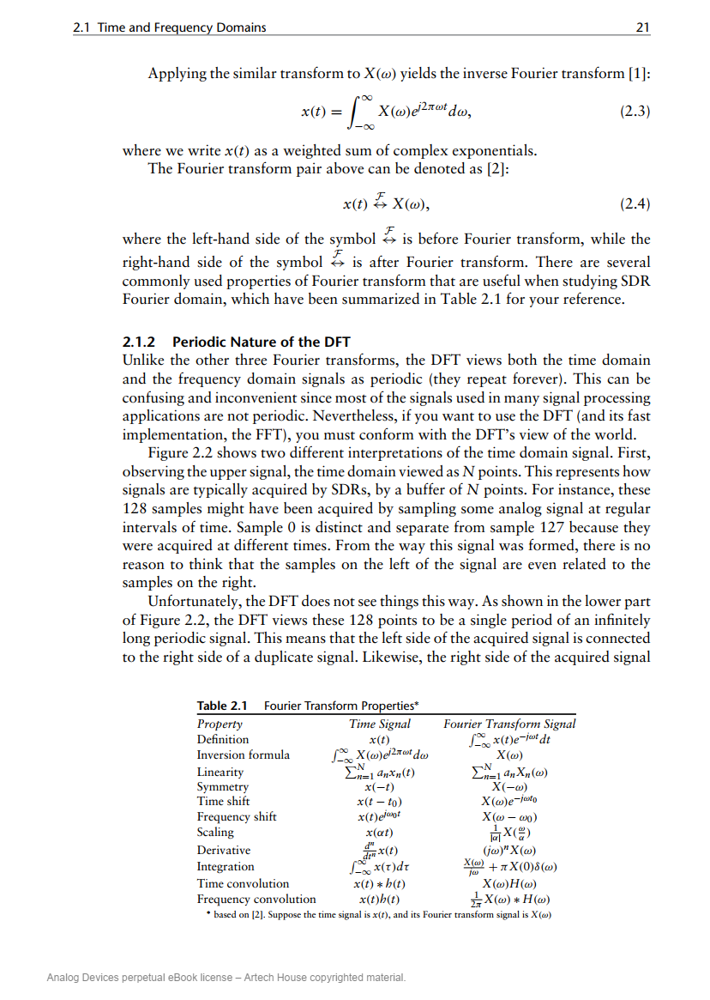
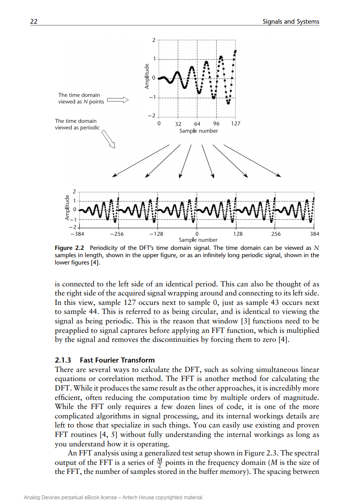

# 2.1.2 Periodic Nature of the DFT
1.Unlike the other three Fourier transforms, the DFT views both the time domain
and the frequency domain signals as periodic (they repeat forever).

2.This is referred to as being circular, and is identical to viewing the
signal as being periodic. This is the reason that window [3] functions need to be
preapplied to signal captures before applying an FFT function, which is multiplied
by the signal and removes the discontinuities by forcing them to zero [4].

